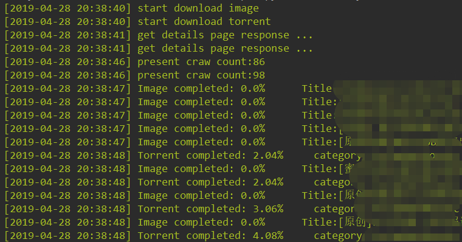
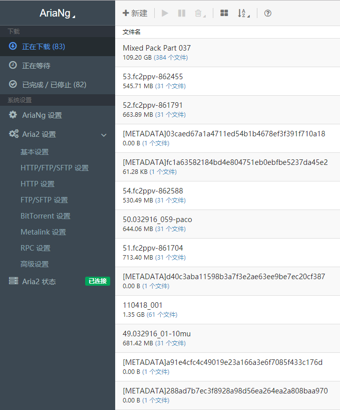

# CaoliuDownload

## 项目说明
   CaoliuDownloads是一个草榴网站的爬虫，可以爬取视频板块的种子文件和图片板块（达盖尔的旗帜）的图片。
   
## 使用方法
   * 程序需要用到MySQL, 如果需要根据种子文件下载视频需要用到Aria2
   * 创建一个数据库，在 **Config** 文件夹下的 **Config.py** 文件里配置数据库 
   * 第一次使用请先运行 **Main** 文件夹里的 **FirstRun.py** 文件，创建表
   * 在 **Config** 文件夹下的 **Config.py** 里配置需要下载的分类，以及保存目录
   * 运行 **Main** 文件夹里的 **Scheduler.py** 文件，开始工作

## 注意事项
   * ARIA2_SAVE_PATH 为视频的保存目录
   * TRACKING_PAGE_COUNT 为跟踪页面数量，最大为100 (草榴限制)
   * DOWNLOAD_CONCURRENT_COUNT 并发数不要设置太大，可能会被草榴限制
   * 如果被限制了可以设置 Cookies
   
## 运行状态
   ### 爬取种子和图片
   
   ### Aria2 下载
   
   ### 种子文件
   
